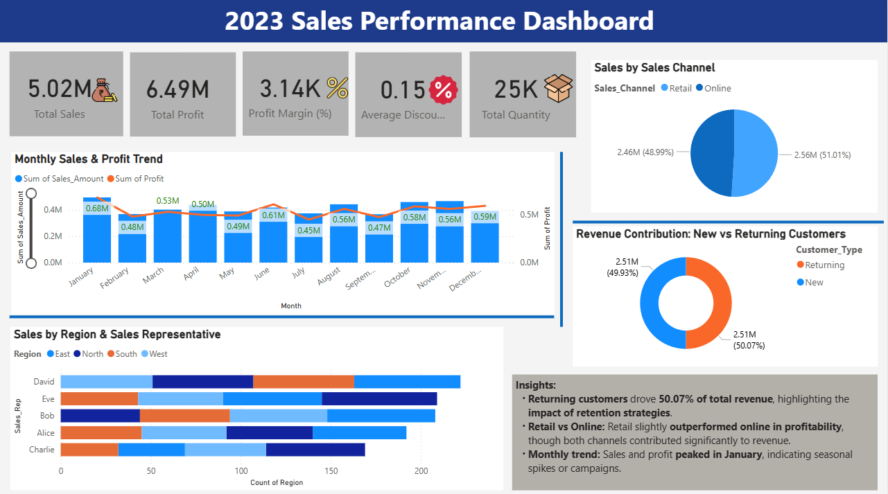
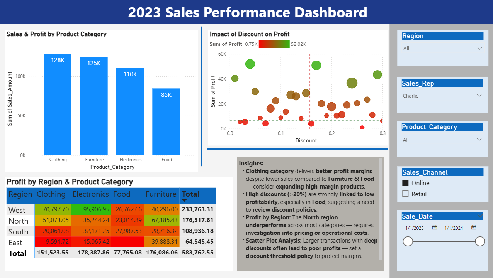

# 📊 2023 Sales Performance Dashboard – Power BI

This project provides a **Power BI dashboard** for analyzing sales, profit, and customer insights using the **Superstore 2023 dataset**.  
It is designed for **business managers** and **analysts** to track performance and identify key optimization opportunities.

---

## 📂 **Dataset**
The dataset includes the following columns:
- 🆔 **Product_ID** – Unique identifier for each product
- 📅 **Sale_Date** – Date of the sale (2023)
- 👩‍💼 **Sales_Rep** – Sales representative (Alice, Bob, Charlie, David, Eve)
- 🌍 **Region** – Sales region (North, South, East, West)
- 💰 **Sales_Amount** – Total sales amount per transaction
- 📦 **Quantity_Sold** – Units sold
- 🛒 **Product_Category** – Product category (Electronics, Furniture, Clothing, Food)
- 💵 **Unit_Cost** – Cost per unit
- 💲 **Unit_Price** – Selling price per unit
- 🧑‍🤝‍🧑 **Customer_Type** – New or Returning
- 🎟️ **Discount** – Discount applied (0%–30%)
- 💳 **Payment_Method** – Payment mode (Credit Card, Cash, Bank Transfer)
- 🏬 **Sales_Channel** – Sales channel (Online or Retail)
- 📊 **Region_and_Sales_Rep** – Combined Region & Sales Rep field
- 📈 **Profit** – (Unit Price - Unit Cost) * Quantity - Discount

---

## 📑 **Pages & Insights**

### **Page 1: Executive Overview**
- **KPI Cards:** Total Sales, Total Profit, Profit Margin %, Avg Discount %, Total Quantity Sold
- **Monthly Sales & Profit Trend:** 📈 Line + Column chart with dual-axis
- **Sales by Channel:** 🥧 Pie chart (Online vs Retail)
- **New vs Returning Customers:** 🍩 Donut chart
- **Sales by Region & Sales Rep:** 📊 Stacked bar chart
- **Insights Box:** High-level business takeaways

### **Page 2: Deep Dive**
- **Sales & Profit by Category:** 📊 Clustered column chart
- **Profit by Region & Category:** 🔥 Matrix with conditional heatmap
- **Impact of Discount on Profit:** ⚡ Scatter plot with reference lines
- **Insights Box:** Recommendations for improving profitability

---

## 🌟 **Features**
- **Dual-axis combo chart** for Sales & Profit comparison
- **Conditional formatting** for matrix & charts
- **Reference lines** for average profit & discount in scatter plot
- **Insight boxes** summarizing key findings
- **Interactive slicers**: Region, Sales Rep, Category, Channel, Date

---

## 🛠 **How to Use**
1. Open the `.pbix` file in Power BI Desktop.
2. Refresh data if needed (CSV provided in the `data/` folder).
3. Use the slicers to filter by **Region**, **Sales Rep**, **Category**, and **Date**.
4. Review **Insights Boxes** for actionable recommendations.

---

## **Screenshots**

  

  

---
